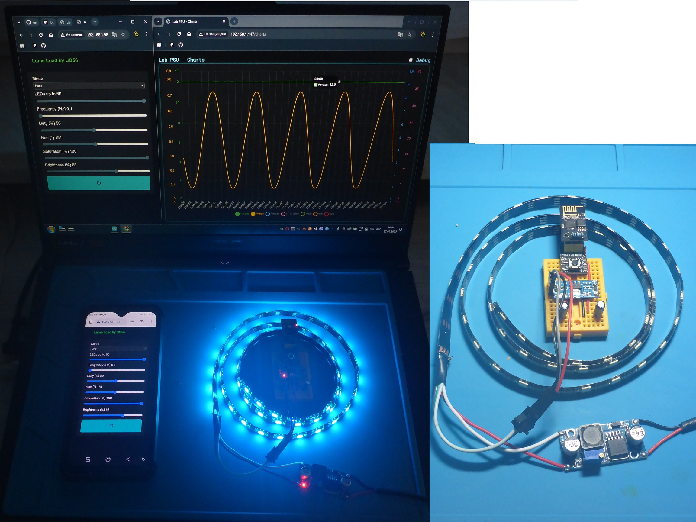

# UG56 Lume Load

**A lightweight web interface for controlling addressable LED strips**

---

## Overview

UG56 Lume Load is a compact, browser-based tool for controlling addressable LED strips using an ESP8266 or ESP32 microcontroller. It provides an intuitive interface to manage LED animations, colors, and brightness in real-time via WebSocket, optimized for low-resource devices like the ESP-01.

*Screenshot of the web interface showing sliders, power button, and active LEDs.*

---

## Live Demo

You don’t need an ESP to try the interface — check out the interactive demo!  

 [Open Demo](https://universalgeek56.github.io/UG56-Lume-Load/demo.html)

> The demo runs fully in your browser.  
> Play with sliders, change colors, and toggle power to see how the UI works.

---

## Features

- **Interactive Controls**: Sliders for selecting animation modes, color (HSV), brightness, frequency, and duty cycle.
- **LED Management**: Adjust the number of active LEDs (up to 60).
- **Power Toggle**: On/off button with visual feedback (HSV-based color or gray when off).
- **Real-Time Updates**: WebSocket ensures seamless synchronization between the interface and the LED strip.
- **Lightweight Design**: Minimal resource usage, suitable for ESP8266 (512 KB flash, ~80 KB RAM).
- **Responsive UI**: Works in modern browsers on desktop and mobile devices.

---

## Requirements

- **Hardware**: ESP8266 (e.g., ESP-01) or ESP32, addressable LED strip (e.g., WS2812B).
- **Software**:
  - Arduino IDE or PlatformIO.
  - Libraries: `ESP8266WiFi`, `ESPAsyncTCP`, `ESPAsyncWebServer`, `ArduinoJson` (v6.x or v7.4.2).
- **Network**: Wi-Fi connection for accessing the web interface.

---

## Installation

1. Clone or download this repository to your local machine.
2. Open the project in Arduino IDE or PlatformIO.
3. Configure the LED strip pin in `Config.h` (e.g., `LED_PIN = 2`).
4. Install required libraries via the Arduino Library Manager or PlatformIO:
   - `ESP8266WiFi`
   - `ESPAsyncTCP`
   - `ESPAsyncWebServer`
   - `ArduinoJson`
5. Upload the firmware to your ESP8266/ESP32.
6. Connect to the device's Wi-Fi network (or configure it as a client in `NetManager.cpp`).
7. Open the device's IP address in a modern web browser.

---

## Usage

1. **Select Animation Mode**: Choose from Static, Sine, Rect, Saw, or Triangle via the dropdown.
2. **Adjust LED Count**: Set the number of active LEDs (0–60) using the slider.
3. **Tune Frequency and Duty Cycle**: Control animation speed (0.1–2 Hz) and duty cycle (0–100%).
4. **Set Color and Brightness**: Use HSV sliders (Hue: 0–360°, Saturation: 0–100%, Brightness: 0–100%).
5. **Toggle Power**: Click the power button to turn LEDs on/off (gray when off, colored when on).
6. Monitor real-time updates as settings are applied instantly via WebSocket.

---

## Project Structure

- **`Config.h`**: Defines hardware settings (e.g., LED pin).
- **`Globals.h`**, **`Globals.cpp`**: Global variables for LED state (mode, hue, saturation, brightness, etc.).
- **`NetManager.h`**, **`NetManager.cpp`**: Wi-Fi connection management.
- **`DemoManager.h`**, **`DemoManager.cpp`**: LED animation logic (Static, Sine, Rect, Saw, Triangle).
- **`WebInterface.h`**, **`WebInterface.cpp`**: Web server and WebSocket interface.
- **`main.cpp`**: Main sketch to initialize and run the system.

---

## Notes

- **Browser Compatibility**: Tested on Chrome, Firefox, Safari (desktop and mobile).
- **Performance**: Optimized for ESP-01 (~39% RAM, ~32% IROM, ~92% IRAM usage).
- **Extensibility**: Easily extendable for additional LED effects or custom hardware.
- **Debugging**: Check the browser's console (F12) for WebSocket errors if controls don't respond.
- **Hardware Setup**:
  - LED strip connected to the pin via a 330 Ω resistor.
  - ESP powered by an LM1117 linear regulator.
  - Added 220 µF capacitors on 5V and 3.3V lines for stability.
  - System powered via an LM2596 buck converter, allowing testing with various power supplies (>5V) under cyclic or constant loads.

---

## Support the Project

If you find UG56 Lume Load useful or inspiring, consider supporting its development on [Ko-fi](https://ko-fi.com/universalgeek56). Your contributions can help fund new features, documentation, or hardware experiments. Thank you for your support!

---

## License

This project is licensed under the MIT License. See the `LICENSE` file for details.

---

## Contributing

Contributions are welcome! Please submit issues or pull requests to the repository. For major changes, open an issue first to discuss your ideas.

---

## Acknowledgments

- Built with the Arduino ecosystem and open-source libraries.
- Inspired by the need for a simple, efficient LED control interface.
